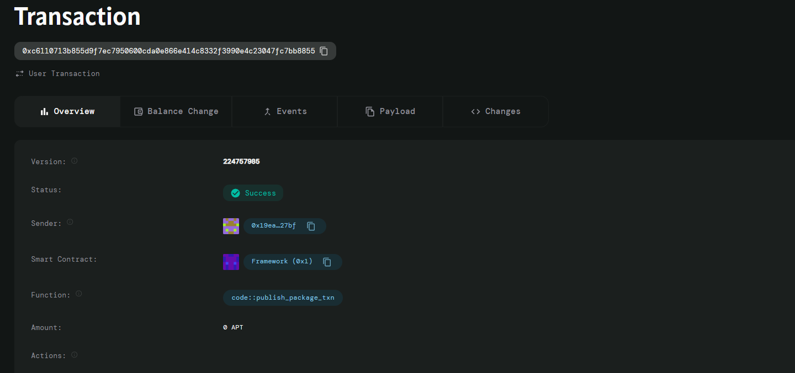

# PrivateVoting

A simple and secure smart contract for anonymous voting on the Aptos blockchain.

## Table of Contents
- [Overview](#overview)
- [Features](#features)
- [Contract Structure](#contract-structure)
- [Functions](#functions)
- [Error Codes](#error-codes)
- [Usage](#usage)
- [Compilation](#compilation)
- [Deployment](#deployment)
- [Example Scenarios](#example-scenarios)
- [Security Considerations](#security-considerations)
- [Contributing](#contributing)

## Overview

The PrivateVoting smart contract enables creation and participation in anonymous voting polls on the Aptos blockchain. Each poll has a customizable title, duration, and collects yes/no votes while maintaining voter anonymity and preventing double voting.

## Features

- ✅ **Anonymous Voting**: Individual vote choices are not stored
- ✅ **Time-bound Polls**: Polls expire after specified duration
- ✅ **Double Vote Prevention**: Each address can only vote once per poll
- ✅ **Custom Poll Titles**: Descriptive poll identification
- ✅ **Real-time Vote Counting**: Immediate vote tallying
- ✅ **Secure Access Control**: Proper validation and error handling

## Contract Structure

```move
struct Poll has store, key {
    title: vector<u8>,          // Poll title/description
    yes_votes: u64,             // Count of yes votes
    no_votes: u64,              // Count of no votes
    end_time: u64,              // Poll expiration timestamp
    voters: vector<address>,    // List of addresses that voted
}
```

## Functions

### `create_poll`
Creates a new voting poll with specified title and duration.

```move
public fun create_poll(
    creator: &signer, 
    title: vector<u8>, 
    duration_hours: u64
)
```

**Parameters:**
- `creator`: Signer who creates the poll
- `title`: Poll title as byte vector (e.g., `b"Should we extend the deadline?"`)
- `duration_hours`: Poll duration in hours

### `cast_vote`
Allows users to vote on an existing poll.

```move
public fun cast_vote(
    voter: &signer, 
    poll_owner: address, 
    vote: bool
) acquires Poll
```

**Parameters:**
- `voter`: Signer casting the vote
- `poll_owner`: Address of the poll creator
- `vote`: Boolean vote (`true` = Yes, `false` = No)

## Error Codes

| Code | Constant | Description |
|------|----------|-------------|
| 1 | `E_POLL_NOT_EXISTS` | Poll does not exist at specified address |
| 2 | `E_POLL_ENDED` | Poll has expired and no longer accepts votes |
| 3 | `E_ALREADY_VOTED` | Voter has already participated in this poll |

## Usage

### Creating a Poll

```move
// Create a 24-hour poll about project extension
create_poll(&creator_signer, b"Should we extend the project deadline?", 24);
```

### Casting Votes

```move
// Vote "Yes" on the poll
cast_vote(&voter_signer, creator_address, true);

// Vote "No" on the poll
cast_vote(&another_voter, creator_address, false);
```

## Compilation

### Prerequisites
- Aptos CLI installed
- Move compiler configured

### Move.toml Configuration

```toml
[package]
name = "PrivateVoting"
version = "1.0.0"

[addresses]
MyModule = "_"

[dependencies.AptosFramework]
git = "https://github.com/aptos-labs/aptos-framework.git"
rev = "mainnet"
subdir = "aptos-framework"
```

### Compile Command

```bash
aptos move compile --skip-fetch-latest-git-deps
```

## Deployment

### Testnet Deployment
```bash
aptos move publish --assume-yes
```

### Mainnet Deployment
```bash
aptos move publish --assume-yes --url https://fullnode.mainnet.aptoslabs.com/v1
```

## Example Scenarios

### Class Poll Example
```move
// Teacher creates a poll for class decision
create_poll(&teacher, b"Should we have the exam next week?", 72);

// Students vote anonymously
cast_vote(&student1, teacher_address, true);   // Yes
cast_vote(&student2, teacher_address, false);  // No
cast_vote(&student3, teacher_address, true);   // Yes

// Final result: 2 Yes, 1 No
```

### Organization Decision
```move
// Manager creates poll for team decision
create_poll(&manager, b"Should we adopt remote work policy?", 168);

// Team members vote
cast_vote(&employee1, manager_address, true);
cast_vote(&employee2, manager_address, true);
cast_vote(&employee3, manager_address, false);
```

## Security Considerations

### Vote Privacy
- Individual vote choices are never stored
- Only aggregate vote counts are maintained
- Voter addresses are stored only for duplicate prevention

### Time Security
- Polls automatically expire after specified duration
- Uses blockchain timestamp for reliable time checking
- No votes accepted after expiration

### Access Control
- Only poll creators can create polls at their address
- Any user can vote on existing polls
- Comprehensive validation prevents invalid operations

### Potential Limitations
- Voter addresses are stored (not completely anonymous)
- No vote withdrawal or changing mechanism
- Binary voting only (yes/no)

## Gas Optimization

The contract is optimized for minimal gas usage:
- Simple data structures
- Efficient vote counting
- Minimal storage operations

## Testing

### Unit Tests
```bash
aptos move test
```

### Integration Testing
Test with multiple scenarios:
- Normal voting flow
- Double voting prevention
- Expired poll handling
- Non-existent poll errors

## Future Enhancements

- Multiple choice voting options
- Vote weight based on token holdings
- Poll result queries
- Voting delegation mechanisms
- Enhanced privacy with zero-knowledge proofs

## Contributing

1. Fork the repository
2. Create a feature branch
3. Make changes and add tests
4. Submit a pull request

## Contract Details
0xc6110713b855d9f7ec7950600cda0e866e414c8332f3990e4c23047fc7bb8855
